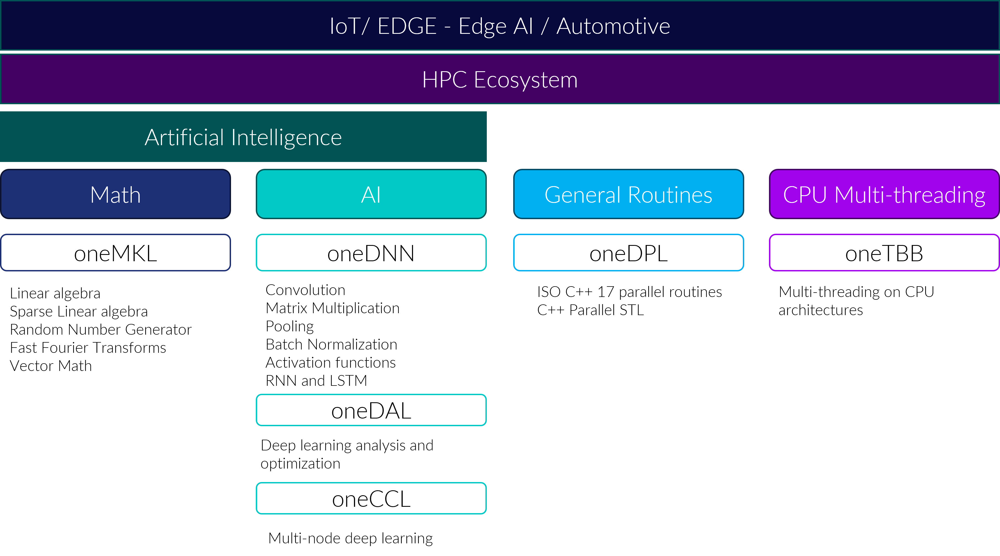

======================
UXL Foundation Charter
======================

Introduction
============

The landscape of computing has changed, and increasingly architectures are 
heterogeneous, consisting of multiple types of processors from different 
vendors. The top supercomputers are now dominated by architectures that 
predominantly use GPUs. Data centres and embedded/edge systems are integrating 
CPUs and GPUs from multiple vendors alongside specialised processors for 
domains such as AI. This change has reached all industry verticals from 
finance and healthcare through to autonomous vehicles and manufacturing.
What this means is that there is a growing demand for software acceleration 
using architectures that consist of different types of accelerators from 
multiple vendors.

Multiple types of processors are used to accelerate various software applications, 
in particular for AI. Large data centres and clusters are increasingly using 
large numbers of GPUs to accelerate data intensive workloads including those used 
in AI.

A survey done by Evans Data in 2024 found that more than half of developers are 
now designing software to account for processor specifics across multiple hardware 
architectures including CPUs, GPUs or accelerators*. 

+----------------------------------------+---------------------------------------+
| .. figure:: images/cpu-gpu-npu-ai.png  | .. figure:: images/cpu-gpu.png        |
|    :width: 400                         |    :width: 400                        |
|    :alt: cpu-npu-gpu-ai                |    :alt: cpu-gpu                      |
+========================================+=======================================+
| Multiple types of processors are used  | Large data centres and clusters are   |
| to bring acceleration to different     | increasingly using large numbers of   |
| types of software, in particular for   | GPUs to accelerate data intensive     |
| AI.                                    | workloads including those used in AI. |
+----------------------------------------+---------------------------------------+

The Challenge
=============
  
The emergence of heterogeneous architectures poses two main challenges for 
software developers:

1. Easily developing software that can be used with different architectures 
   and vendors of accelerators such as GPUs and AI processors
2. Achieving good levels of performance across architectures and vendors

The UXL Foundation
==================
  
The goals of the `UXL Foundation`_ aim to address these challenges by:

- Building a multi-architecture multi-vendor software ecosystem for all 
  accelerators.
- Unifying the heterogeneous compute ecosystem around open standards.
- Enabling collaboration around open-source projects for accelerated computing.

The UXL Foundation enables developers to write source code once and 
deploy it across accelerators, regardless of vendor, by facilitating  
collaboration between organisations designing the latest processors and 
software developers building the latest innovative solutions.
We create the environment required for cross-industry participation 
on the specification and open source projects that are governed by the UXL 
Foundation. This is achieved by adopting best practices for open source 
development and providing the structure for open discussion and decision making.
The UXL Foundation is part of the Linux Foundation and is founded on the 
principles of open governance, as outlined in the UXL `GitHub repository`_.

UXL Foundation Projects
=======================

Initially a set of C++ projects and specifications were contributed to the UXL 
Foundation forming fundamental building blocks that cover accelerated operations 
required by most software applications and frameworks.

- For GPU acceleration, the projects use the `SYCL`_ open standard, a programming 
  model defined by the Khronos Group. SYCL makes it possible to write kernels 
  that can be executed in parallel using standard C++ code and compiled for a 
  range of processors. 
- For CPU acceleration most projects use `oneTBB`_, an open source framework 
  that provides multi-threading capabilities.

The `oneAPI specification`_ defines the APIs for these projects.

A list of specific areas where the community can contribute to projects is 
being added to the project issue trackers under the “Help Wanted” label.
Proposals for significant changes or additions to the projects can be made through 
the RFC process, Open Source Working Group, and discussions can be had on the 
`Slack`_ channel.

The current work packages are tracked on the `Open Source Working Group GitHub 
repository`_.

Accelerated Building Blocks
===========================

Open Source Development
=======================

Making open source code available is not enough to build a sustainable open 
source project with many contributors, maintainers and users. An open source 
project requires a set of fundamentals that an open source needs, such as 
open decision robust build infrastructure in order to be successfully 
adopted across the community. The projects have adopted the best practices 
for open source development, such as using the OpenSSF security badge, and 
the project health is monitored regularly and reviewed by the Working Group 
and Steering Committee.

Math Domains - The `oneMath`_ project
=====================================

The oneAPI specification defines the oneMath API (formerly oneMKL) covering 
BLAS, LAPACK, RNG, DFT and SPARSE math domains.
The open source `oneMKL`_ interfaces project implements the specification, 
providing a standard API for these math domains. The project uses industry 
standards where available, such as for BLAS, to define the API arguments. The 
project integrates with multiple back ends to enable deployment to different 
processors:

- Intel oneMKL optimized library for Intel CPU and GPU
- Nvidia cuBLAS, cuSOLVER, cuRAND, and cuFFT optimized libraries for Nvidia GPU
- AMD rocBLAS, rocSOLVER, rocRAND, and rocFFT optimized libraries for AMD GPU
- Open source NETLIB LAPACK library for x86 CPU
- Open source portBLAS and portFFT SYCL code for x86 CPU, AMD GPU, Intel GPU, 
  Nvidia GPU

A matrix of targets available and domains is available in the project README.

Contributions to the oneMath Project
------------------------------------

Broadening support for processors
^^^^^^^^^^^^^^^^^^^^^^^^^^^^^^^^^

New backends targeting different processors including new host CPUs such as 
RISC-V can be added to the project. Public documentation on how to do 
this is available. Pull Requests can be made with additions for integrations 
with vendor libraries or open source code. In addition to new backend work, 
testing resources for existing processor targets are needed to ensure these can 
be treated as supported targets. Alongside this, the community can contribute 
to helping make the project easy to install as well as showing what level of 
support is available for different processors based on the different math 
domains.

Public Build and CI
^^^^^^^^^^^^^^^^^^^

There is an ongoing work package to set up sufficient public CI infrastructure 
for the projects. This will document how new community managed build 
machines can be added and make additional infrastructure available. Please 
contact the Open Source Working Group to contribute CI resources for the 
oneMath project.

Open Source Contributions
^^^^^^^^^^^^^^^^^^^^^^^^^

Some open source implementations of the math domains are available for CPU and 
GPU but gaps exist, and the open source implementations could be further 
optimized for specific processors. Additionally a documented approach for 
how to consistently add new hardware targets for the library would help 
the project to cover a broader set of processors.
The project is also seeking code owners and maintainers for some hardware 
targets.

Acceleration for AI Applications and Frameworks - `oneDNN`_
===============================================================

The oneAPI specification defines the oneDNN API covering convolution, matrix 
multiplication, pooling, batch normalization, activation functions, RNN and 
LSTM. These are currently the most commonly used operators for AI software, 
used by frameworks such as TensorFlow and PyTorch.
The open source `oneDNN`_ project implements the specification and provides a 
standard API for commonly used operators on:

- Intel GPU
- x86-64, aarch64, IBM Power, RISC-V 64 CPUs
- Nvidia GPU (experimental)
- AMD GPU (experimental)

oneDNN is currently used by a variety of AI projects including PyTorch, 
TensorFlow, and Paddle Paddle amongst others for software acceleration on a 
variety of processors, including both CPUs and GPUs.

The oneDNN project is seeking code owners and maintainers for some hardware 
targets, see the `oneDNN Maintainers`_ file for details.

Contributions to expand the processor targets supported by oneDNN, as well as 
support to bring the Nvidia and AMD GPU targets out of experimental status are 
welcome. Resources for public CI infrastructure are required both to expand  
testing of existing target processors and to help bring target processors out 
of experimental status (in particular Nvidia and AMD). Join the `Slack`_ 
channel to discuss contributions and see the `oneDNN Contributing`_ file for 
details.

Parallel ISO C++ - `oneDPL`_
============================

Based on the ISO C++ standard definition for parallel routines and algorithms, 
the oneAPI specification defines the oneDPL interfaces and execution model to 
integrate the SYCL programming model. Developers use a SYCL queue and memory 
management alongside the ISO C++ parallel routines and algorithms.
The open source `oneDPL`_ project implements the specification and uses SYCL code 
to provide portability for the project across architectures and vendor processors 
including GPUs, FPGAs and CPUs.
Currently the project only lists Intel processors as targets, but since the 
code is implemented using SYCL it can be compiled and used with other targets 
supported by the DPC++ compiler such as Nvidia and AMD GPUs.
Contributions to extend the project and/or optimize it for more processor 
targets are welcome. Resources for CI infrastructure to cover testing and 
building on more target processors are required. Join the `Slack`_ channel to 
discuss contributions.

Accelerated AI Data Analysis – `oneDAL`_
========================================

The oneAPI specification defines interfaces for oneDAL, used in big data 
analysis through optimized data ingestion alongside algorithms. 
The open source `oneDAL`_ implementation provides accelerated algorithms used 
by machine learning packages such as SciKit Learn. These algorithms can be 
executed on CPUs and GPUs through a range of backends, and the project has some 
dependencies on oneTBB for CPU multi-threading and Intel oneMKL for BLAS.
The project lists Intel CPUs and GPUs as supported targets however it can 
be used with Arm CPUs and work is underway for RISC-V CPUs. The project team 
is implementing SYCL kernel code for the algorithms and once available brings 
the potential for much broader processor target support.
Contributions to extend the project or optimize it for more processor targets 
are welcome. There is also an opportunity to bring more infrastructure for 
building and testing on more Arm processor targets.

Multi-node deep learning – `oneCCL`_
====================================

The oneAPI specification defines interfaces for oneCCL, used to define concepts 
and objects that operate on data. This includes operations that the open source 
`oneCCL`_ project implements as well as the specification, and provides efficient 
communication patterns for deep learning. The specification is designed for use 
on systems consisting of multiple nodes where work is distributed and effective 
data transfer can help accelerate the software. The project is integrated with 
PyTorch and Horovod. Currently the project only lists Intel CPUs and GPU 
processors as targets, but there is potential for the project to be used with 
other targets. Contributions to bring more processor targets to oneCCL as well 
as resources for public build and CI infrastructure are required.

CPU Multi-threading – `oneTBB`_
===============================

The oneAPI specification defines the interfaces for oneTBB which is used for 
multi-threading on CPUs.
The open source `oneTBB`_ project implements the specification and broadly 
speaking can be used with any x86 and aarch64 processor, but specific support 
is provided for Intel CPUs listed on this page, and community supported 
processors are also listed.
Other UXL Foundation projects utilize the oneTBB project to achieve 
acceleration on CPU devices, specifically oneDAL, oneDPL and oneDNN. Many 
software projects worldwide using oneTBB to accelerate software on CPUs. 
Contributions to test a broad range of processor targets with oneTBB are 
welcome in the form of CI or build infrastructure. The project does not 
currently test RISC-V CPUs and some functionality is missing.

Hardware Enablement - `oneAPI Construction Kit`_
================================================

The oneAPI Construction Kit can be used to bring SYCL and oneAPI to new and 
specialist accelerators. The oneAPI Construction Kit works enables the CPU 
to offload compute-intensive kernels to the custom accelerator. The project 
includes a reference implementation using RISC-V.

The UXL Foundation Work Areas
=============================

This section outlines the primary areas where contributors can help support 
the foundation and its projects in achieving their objectives.

Hardware Support
----------------

The UXL projects aim to support a broad range of processors from different 
vendors. Each project shows the currently supported hardware in the project 
documentation. Contributions can be made to introduce new target processors 
and/or to provide build and testing resources for these targets to improve 
support. 

Potential contributors can contact the project team through the `Slack`_ channel 
or `mailing list`_ to discuss with the project maintainers and the community 
about how they can assist with this work.

Distribution
------------

The broad distribution of UXL projects across Linux distributions and through 
commercial releases such as the Intel oneAPI Base Toolkit relies on robust 
testing across hardware, operating systems and driver level software. This 
requires infrastructure hosted by the foundation and community members 
including processor vendors and Linux distributions. A work package for public 
build infrastructure is ongoing and community contributions are welcomed to 
this effort. Contact the Open Source Working Group through the `Slack`_ 
Channel or `mailing list`_.

Open Source
-----------

The UXL Foundation is based on the principles of open source software and as 
such all projects try to use open source components where possible. For some 
projects, such as oneMath, open source code can be contributed to ensure 
there is an open source implementation alongside any closed source vendor 
libraries. This ensures that developers can use the necessary functionality 
they need across targets and have access to fully open source versions of the 
projects. Use the `Slack`_ channel or `mailing list`_ to talk about what open source 
contributions could be made to different projects.

Optimisation
------------

The UXL Foundation projects have been optimized for some targets but there is 
always room for further code optimization more for different targets. The 
projects may have issues for these items, but if not please talk to the 
project teams through the `Slack`_ channels or `mailing list`_.

Software Integration
--------------------

The UXL Foundation projects sit low in the software stack providing building 
blocks for many other applications, libraries and frameworks. There must be a 
level of compatibility and integration for the UXL Foundation projects. 
Collaboration with key open source projects is essential. If your project is 
working with UXL Foundation projects please share your feedback, issues and 
ideas through GitHub or the SIG meetings. Get in touch via the `Slack`_ 
channels or `mailing list`_.

\* `Evans Data Article on Multiarchitecture Programming`_

.. _`UXL Foundation`: https://www.uxlfoundation.org
.. _`sycl`: https://www.khronos.org/sycl/
.. _`oneTBB`: https://github.com/oneapi-src/oneTBB
.. _`oneMath`: https://github.com/oneapi-src/oneMath
.. _`oneDNN`: https://github.com/oneapi-src/oneDNN
.. _`oneDAL`: https://github.com/oneapi-src/oneDAL
.. _`oneCCL`: https://github.com/oneapi-src/oneCCL
.. _`oneDPL`: https://github.com/oneapi-src/oneDPL
.. _`oneAPI Construction Kit`: https://github.com/uxlfoundation/oneapi-construction-kit
.. _`Slack`: http://slack-invite.uxlfoundation.org/
.. _`Open Source Working Group GitHub repository`: https://github.com/uxlfoundation/open-source-working-group
.. _`oneAPI specification`: https://oneapi-spec.uxlfoundation.org/specifications/oneapi/latest/
.. _`mailing list`: https://lists.uxlfoundation.org
.. _`GitHub project board`: https://github.com/orgs/uxlfoundation/projects/5?pane=info
.. _`oneDNN Maintainers`: https://github.com/oneapi-src/oneDNN/blob/main/MAINTAINERS.md
.. _`oneDNN Contributing`: https://github.com/oneapi-src/oneDNN/blob/main/CONTRIBUTING.md
.. _`GitHub repository`: https://github.com/uxlfoundation/foundation
.. _`Evans Data Article on Multiarchitecture Programming`: https://evansdata.com/press/viewRelease.php?pressID=364
